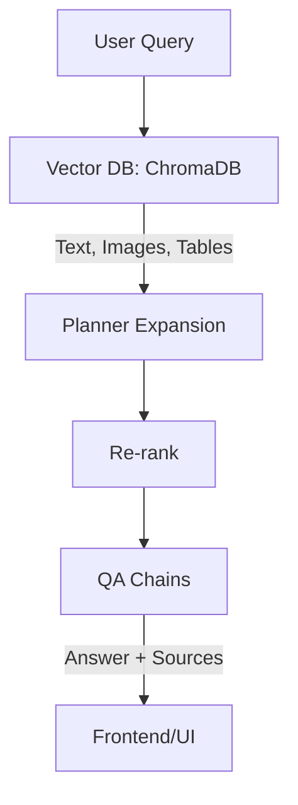

# ER-NEXUS: Renal Nutrition & Evidence eXtraction Unified System

## Table of Contents
- [Overview](#overview)
- [System Architecture](#system-architecture)
- [Re-ranking & Response Generation](#re-ranking--response-generation)
- [Data Collection](#data-collection)
- [Frontend & UI/UX](#frontend--uiux)
- [Configuration](#configuration)
- [Quickstart (Local)](#quickstart-local)
- [Production Deployment (No-Docker)](#production-deployment-no-docker)
- [Production Deployment (Docker)](#production-deployment-docker)
- [API Endpoints](#api-endpoints)
- [Evaluation (Optional)](#evaluation-optional)
- [Project Directory Structure](#project-directory-structure)
- [Developer Workflow](#developer-workflow)
- [Citation](#citation)

---

## Overview

**ER-NEXUS** is an **agentic multimodal RAG** (Retrieval-Augmented Generation) system that provides evidence-based guidance on **diet and microbiome management** for individuals with **Chronic Kidney Disease (CKD)** and **End-Stage Renal Disease (ESRD)**. The system Merges dietary strategies and probiotic intervention into an unified suggestion pipeline. There is also potential scope and adaptation for other conditions beyond CKD and ESRD.


  

**Disclaimer:** This system is purely experimental and intended for research purposes.

### Key Components
- **`app.py`** — Flask entry point. Initializes retrievers, loads cached data, and routes UI/API.  
- **`config.yaml`** — Central configuration for models, UI, retrieval, and dietary rules.  
- **`ernexus/config.py`** — Pydantic models for config parsing/validation.  
- **`ernexus/chains/qa.py`** — Defines QA pipelines (answer-only vs. answer+citations).  
- **`ernexus/retrieval/vectorstore.py`** — Manages Chroma vector store.  
- **`ernexus/guards/`** — Guards for unsafe or irrelevant inputs.  
- **`ernexus/rules/`** — Encoded dietary rules/constraints.  

---

## System Architecture

The architecture uses a **multi-vector retriever with Chroma** to handle multimodal sources (**text, tables, images**). Queries are expanded with a **planner**, re-ranked, and passed to QA chains for final response generation.  

### Architecture Flow 


---

## Re-ranking & Response Generation

- Retrieved documents are **re-ranked** for maximum relevance.  
- QA modes:
  - **Answer-only mode** → concise output.  
  - **Agentic mode** → answer with sources.  

---

## Data Collection

Data is preprocessed and cached for **fast runtime performance**.  

### `.pkl` Cache Files
Located in `data_cache/`:  
- `texts.pkl` → raw text items  
- `text_summaries.pkl` → text summaries  
- `images.pkl` → base64-encoded images  
- `image_summaries.pkl` → captions & summaries  
- `tables.pkl` → structured tables  
- `table_summaries.pkl` → summaries of tables  

The system is robust against missing/unreadable files.  

---

## Frontend & UI/UX

- Built with **Flask**.  
- Clean **glass-like aesthetic**.  
- Features:
  - Query input → contextualized answers  
  - Highlighted terms  
  - Sources inline  

---

## Configuration

Configuration is stored in **`config.yaml`**, validated by `ernexus/config.py`.  

### Example `config.yaml`
```yaml
app:
  title: "ER-NEXUS"
  description: "Renal Nutrition & Evidence eXtraction"
  debug: true

paths:
  cache_dir: "./data_cache"
  chroma_db: "./chroma"

retrieval:
  collection: "renal_nutrition"
  top_k: 5

models:
  llm: "gpt-4o"
  embedding: "text-embedding-3-large"

ui:
  sample_queries:
    - "What probiotics are recommended for CKD patients?"
    - "Summarize the effect of phosphorus intake on ESRD."

rules:
  sodium_limit: 2000
  potassium_limit: 2500
  phosphorus_limit: 1000
```

---

## Quickstart (Local)

1. **Install dependencies**
   ```bash
   pip install -r requirements.txt
   ```

2. **Set up environment**
   ```bash
   cp .env.example .env
   ```
   Add API keys in `.env`.

3. **Run the app**
   ```bash
   python app.py
   ```

---

## Production Deployment (No-Docker)

Run with Gunicorn:  
```bash
gunicorn app:app --workers 4 --bind 0.0.0.0:8000
```

Example **Procfile**:
```
web: gunicorn app:app --workers=4 --bind=0.0.0.0:$PORT
```

---

## Production Deployment (Docker)

1. **Build image**
   ```bash
   docker build -t ernexus .
   ```

2. **Run container**
   ```bash
   docker run -p 8000:8000 ernexus
   ```

---

## API Endpoints

| Method | Endpoint   | Description                  |
|--------|-----------|------------------------------|
| GET    | `/`       | Main UI page                 |
| POST   | `/`       | Accepts query, returns JSON  |
| GET    | `/health` | Health check status          |

---

## Evaluation (Optional)

Evaluation can be performed using:  
- **Expert review** (manual validation)  
- **NLP metrics**: BLEU, ROUGE, BERTScore  

---

## Project Directory Structure

```
ER-NEXUS/
├─ app.py
├─ config.yaml
├─ requirements.txt
├─ Procfile
├─ .env
├─ Dockerfile
├─ .dockerignore
├─ render.yaml
├─ ernexus/
│  ├─ __init__.py
│  ├─ config.py
│  ├─ formatting.py
│  ├─ prompts/
│  │   ├─ qa_prompts.py
│  │   └─ retrieval_prompts.py
│  ├─ utils/
│  │   ├─ logger.py
│  │   └─ helpers.py
│  ├─ io/
│  │   └─ loaders.py
│  ├─ retrieval/
│  │   ├─ vectorstore.py
│  │   └─ multi_retriever.py
│  ├─ chains/
│  │   ├─ qa.py
│  │   └─ planner.py
│  ├─ guards/
│  │   ├─ input_guard.py
│  │   └─ safety.py
│  └─ rules/
│      └─ diet_rules.yaml
├─ templates/
│  ├─ base.html
│  ├─ chat.html
│  └─ results.html
├─ static/
│  ├─ css/
│  └─ js/
└─ data_cache/
   ├─ texts.pkl
   ├─ text_summaries.pkl
   ├─ images.pkl
   ├─ image_summaries.pkl
   ├─ tables.pkl
   └─ table_summaries.pkl
```

---

## Developer Workflow

A concise workflow for extending the system:

1. **Add new retrievers**  
   - Implement in `ernexus/retrieval/`.  
   - Register in `app.py`.  

2. **Add new chains (LLM logic)**  
   - Define in `ernexus/chains/`.  
   - Update config in `config.yaml`.  

3. **Modify dietary rules**  
   - Edit `ernexus/rules/diet_rules.yaml`.  

4. **Adjust prompts**  
   - Update templates in `ernexus/prompts/`.  

5. **Test locally**  
   - Run `python app.py`.  
   - Check `/health` endpoint.  


